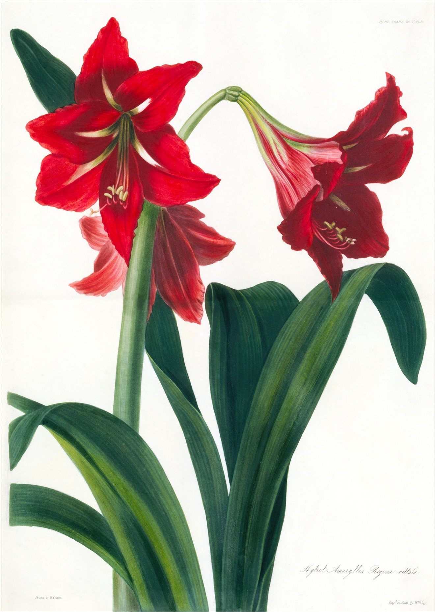

# An Introduction

*Amaryllis hybrid, London Horticulture Society*

Hello user! You've found a book of bioinformatics in Rust. If you're a total beginner to anything bioinformatics, Rust, or programming, then this is the book for you. The first half is all about Rust, while the second half covers useful bioinformatics tools and programming items outside Rust. This book is meant to be a beginner's guide and p0kedex, rather than a complete, grandmaster's p0kedex. I hope it captures your interest like the mysterious beauty of biology captured mine. 

Also, if you want to reach me or have something you want added to the book, let me know [here](keybase.io/kana4)!