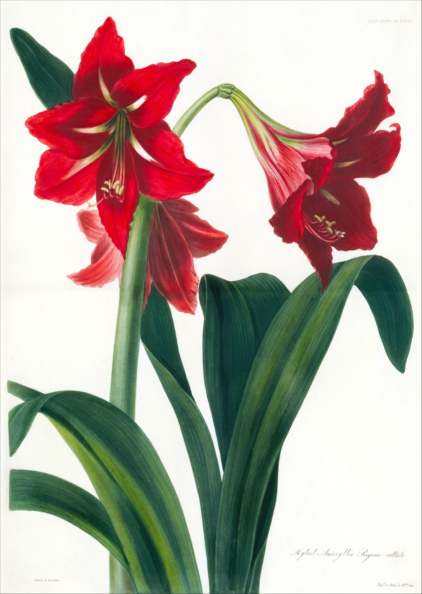

# An Introduction

*Amaryllis hybrid, London Horticulture Society*

Hello user! You've found the book of bioinformatics in Rust. If you're a total beginner to anything bioinformatics, Rust, or programming, then this is the book for you. I hope it captures your interest like biology captured mine!

If you want to reach me or have something you want added to the book, let me know [here](keybase.io/kana4)!