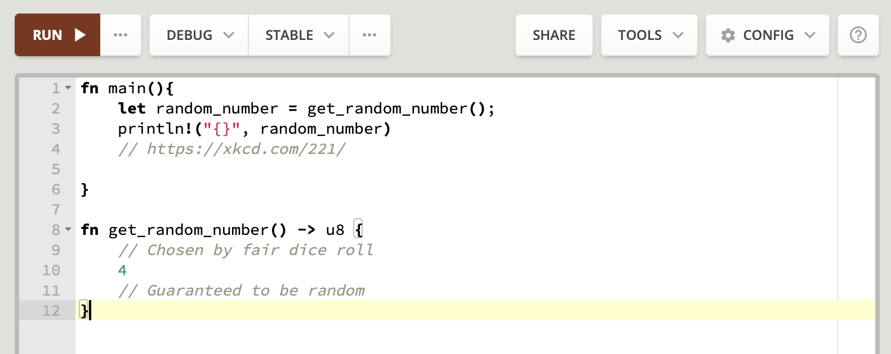

# Background: Binary vs Library

When we get a program, we click it, it opens, and we'll be able to do stuff. We'll have to choose the program based on our operating system.

The program we're downloading is most likely a [compiled](https://en.wikibooks.org/wiki/Introduction_to_Programming_Languages/Compiled_Programs) program. This program is [executable](https://en.wikipedia.org/wiki/Executable) by the specific operating system we're using. The program has system-specific operations amalgamated together so the computer can do the things we want it to in an efficient manner.  In Rust, we create these kinds of programs by telling Rust to make a binary file (e.g. an executable). You may have heard this word before on Windows as the [.exe](https://en.wikipedia.org/wiki/.exe) file type  or just plain no file extension in Ubuntu or Linux. In Rust, we can make all of these file types really easily!

Binaries always have a main function, written `fn main(){}`. This main function is the [Steve Jobs](https://en.wikipedia.org/wiki/Steve_Jobs) (or [Woz](https://en.wikipedia.org/wiki/Steve_Wozniak)) of all things in our binary. Everything that will actually be done is in the main function, with other  functions, definitions, etc. being sourced from everywhere else. We build binaries by typing `cargo build --bin`.

The other kind of thing we make in Rust is a library. While we also build a library with `cargo build --lib`, a library does not have a program that we can just run like what we would imagine. This is because a library's purpose is to be a bunch of small, reusable pieces of code that we can use to make an executable, but aren't really useful to our users. As an analogy, a library is like a tool shed and the binary a house that the user lives in.

## What does all of this mean to me?

We'll be building binaries in this book on the [Rust playground](https://play.rust-lang.org/?version=stable&mode=debug&edition=2018&gist=730c462d7171d22098403822416c698d), a website where everything is already set up for us; there isn't any setup for this book! Each of the exercises will have a link to the playground with the exercise we're working on, it's that easy!

*Getting started in Rust is as simple as opening a webpage!*

[playground](https://play.rust-lang.org/?version=stable&mode=debug&edition=2018&gist=8326f6350e307f3184ca0008ff66a3ec)