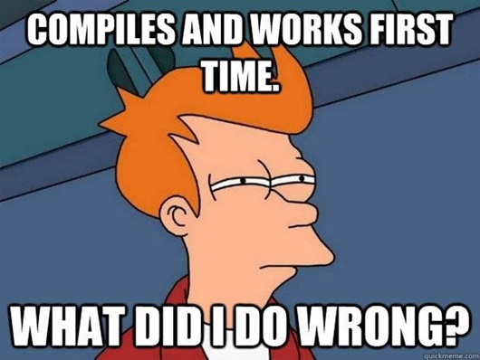

# Background: Binary vs Library

When we get a program, we click it, it opens, and we'll be able to do stuff. We'll have to choose the program based on our operating system.

The program we're downloading is most likely a [compiled](https://en.wikibooks.org/wiki/Introduction_to_Programming_Languages/Compiled_Programs) program. It contains system-specific operations amalgamated together so the computer can do the things we want it to in an efficient manner. In Rust, we create these kinds of programs by telling Rust to make a binary file (e.g. an [executable](https://en.wikipedia.org/wiki/Executable)). You may have heard this word before on Windows as the [.exe](https://en.wikipedia.org/wiki/.exe) file type  or just plain no file extension in Ubuntu or Linux. In Rust, we can make all of these file types really easily!

Binaries always have a main function, written `fn main(){}`. This main function is the [Steve Jobs](https://en.wikipedia.org/wiki/Steve_Jobs) (or [Woz](https://en.wikipedia.org/wiki/Steve_Wozniak)) of all things in our binary. Everything that will actually be done is in the main function, with other functions being sourced from everywhere else.

The other kind of thing we make in Rust is a library. A library does not have a program that we can just run like what we would imagine. This is because a library's purpose is to be a bunch of small, reusable pieces of code that we can use to make an executable, but aren't really meant to be a single program. As an analogy, a library is like a tool shed and the binary a car that the user drives.

*Compiling is the final test to see whether we made a mistake, every programmer duels the compiler!*