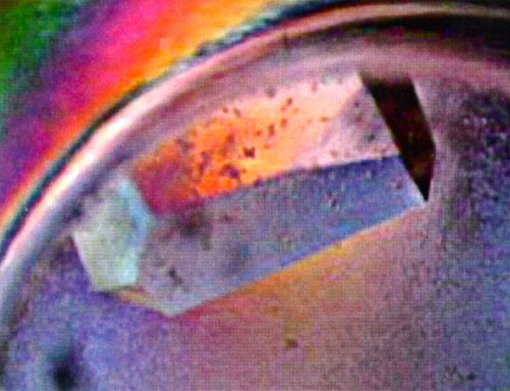

# Biological Sequences

In this chapter, we're going to start working with biological data, finally!

DNA classically contains the four bases ACTG, whereas RNA includes ACUG. In sequencing data, we usually encode RNA data as ACTG for ease of use, and notate that the file is RNA data. We also commonly include 'N', where we're unsure of what base goes there but we think there's something there. 

```
fn main(){
    // DNA vector, RNA is commonly encoded the same way
    let dna = b"ACTG".to_vec();
    // DNA vector containing a base we're unsure of, but think it's present.
    let dna_with_n = b"ACTNG".to_vec();
```



[2mm Crystallized Histone Octamer](https://archive.org/details/MSFC-9807365)

