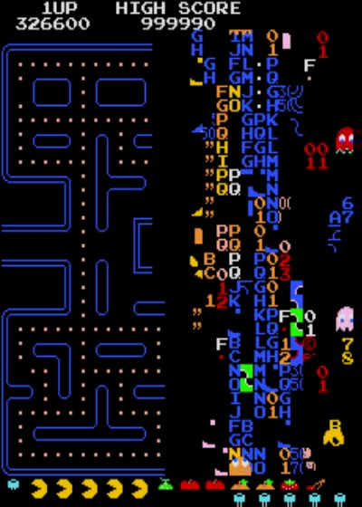

# Integer Overflow

In the last section, we summed the elements in a vector. If we did this directly in real programs, Rust would probably panic and say something along the lines of `integer overflow`, depending on our DNA sequence. This is because unsigned 8-bit integers can only hold a maximum value of 256, so if our sum was larger than 256, Rust wouldn't know what to do and panic. For example:

```
fn main(){
    
    // Changed dna sequence from ACT to ACTG
    
    let dna = b"ACTG".to_vec();

    let mut sum = 0;

    for base in dna {
        sum += base;
    }

    println!("{}", sum);

    // Rust returns an integer overflow error, sum is greater than 256

}
```

Don't worry though, we can fix that easily by converting our `sum` variable into an [unsigned 64-bit integer](https://doc.rust-lang.org/std/primitive.u64.html) (u64). The max number for this integer type: 18,446,744,073,709,551,615! This also means we need to change each element of the vector to a u64 (using the `as` keyword), as we can't add different types of integers.

```
fn main(){

    let dna = b"ACTG".to_vec();

    // We tell Rust that we want sum to equal 0, but 0 as a u64

    let mut sum = 0u64;

    for base in dna {
        
        // convert each element (base) to u64 to add to sum (also u64)

        sum += base as u64; 

    }

    println!("{}", sum);
    
    // Prints 287
}
```
[playground](https://play.rust-lang.org/?version=stable&mode=debug&edition=2018&gist=b0c5cfb4478657b0bbdb1a19c3f37f41)



*Pac Man Integer Overflow! At level 256, Pac Man turns into the [Pac Matrix](https://errors.fandom.com/wiki/Pac_Man_-_Infamous_Kill_Screen_Bug) for the same reasons we get an error here. I wish I was that good at Pac Man!*

## Background

[Numeric types](https://doc.rust-lang.org/reference/types/numeric.html)

Converting between [('casting')](https://doc.rust-lang.org/rust-by-example/types/cast.html) numeric types with `as`
