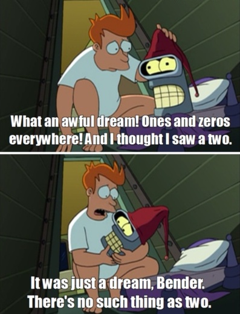

# Check Sequence

Calculating the sum of a sequence is pretty cool, but probably isn't very useful to us in a direct sense. Let's do something with a little more direct application: checking if our sequence is a [homopolymer](https://www.merriam-webster.com/dictionary/homopolymer)!

There's a few steps we're going to do here:

<ul> Store the first element of our sequence in a variable to compare to the other elements </ul>
<ul> Create a separate vector where each element is a boolean true/false. Rust gives us a really nice macro (vec![]) to make an empty vector. </ul>
<ul> For each element in our sequence, check if the element is the same as the first element and push the result into our boolean vector. </ul>
<ul> Print our boolean vector to see our results! </ul>

```
fn main(){

    let vector = b"AAAAA".to_vec();
    
    let first_element = vector[0];

    let mut boolean_vector: Vec<bool> = vec![];

    // For each element, true or false: is the same as the first element    
    for element in vector {
        boolean_vector.push(first_element == element)
    }

    println!("{:?}", boolean_vector);

    // prints [true, true, true, true, true]
}
```

[playground](https://play.rust-lang.org/?version=stable&mode=debug&edition=2018&gist=1bf1cb00cdfce69f3765253711c55c55)


*Bender dreams in boolean vectors*

## Background

Boolean vector representation: [Bit Array](https://en.wikipedia.org/wiki/Bit_array)

[Bit Vector](https://crates.io/crates/bitvec), a crate specialized for this kind of thing, but I don't really understand it yet!