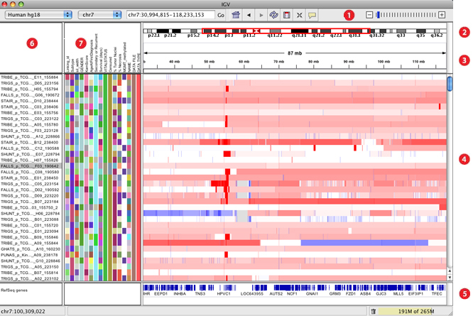

# Biological File Types

Biological data most commonly has a header with a description of the data followed by the data itself. If a variant analysis was done, we might get back a variant call file ([VCF](https://en.wikipedia.org/wiki/Variant_Call_Format)), which will annotate variants from a genome reference. Sequencing Alignment Mapping ([SAM](https://en.wikipedia.org/wiki/SAM_(file_format))) files are usually a lot larger and contain all the sequencing data aligned to our genome reference. [Fasta](https://en.wikipedia.org/wiki/FASTA_format) files (not really short for anything) are the simplest of all; they only contain sequences and descriptions of the sequences. We'll take a quick look at these file types so we know what we could be working with.

*Visualizing genomic data looks pretty complicated, but IGV makes it easy! IGV's got so many features that it has it's own [Youtube](https://www.youtube.com/watch?v=E_G8z_2gTYM)!*

If you want to know more, check out the [IGViewer section in the index](../Index/IGViewer.md).

[Official File Format Specifications](http://samtools.github.io/hts-specs/). Includes VCF, SAM, CRAM, BAM, BCF, CSI, Tabix, crypt4gh, htsget, and Refget. We'll go over these, so don't worry about it yet!

