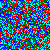

# Colored Image

Our image has a single row of colored pixels, but we can fill the whole image with colors if we repeat the process for each row. Let's try it!

```
use image::RgbImage;
use bioutils::utils::image::color::*;
const WIDTH: u32 = 50;
const HEIGHT: u32 = 50;

fn main() {
    
    // Create a new image

    let mut img = RgbImage::new(HEIGHT, WIDTH); 

    // Let's do the same thing with random sequences for the whole file

    for y in 0..HEIGHT {
        let rng = rand::thread_rng(); // Create a random number generator
        let dna = random_dna(50,rng); // Get a random dna sequence of length 50
        for (x, c) in dna.into_iter().enumerate() {
            match c {
                67 => img.put_pixel(x as u32, y, RED_RGB), // 67 is b"A", set Adenosine color
                65 => img.put_pixel(x as u32, y, GREEN_RGB), // 65 is b"C", set Cytosine color
                84 => img.put_pixel(x as u32, y, BLUE_RGB), // 84 is b"T", set Thymine color
                71 => img.put_pixel(x as u32, y, CYAN_RGB), // 71 is b"G", set Guanine color
                78 => img.put_pixel(x as u32, y, GRAY_RGB), // 110 is b"N", set Undetermined color
                _ => img.put_pixel(x as u32, y, BLACK_RGB), // any other integer set to black
            };
        }
    }
    // write it out to a file
    img.save("mysecondimage.png").unwrap();
}
```

TADA!



*Our Second Image! A lot more color than our first!*